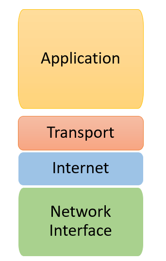
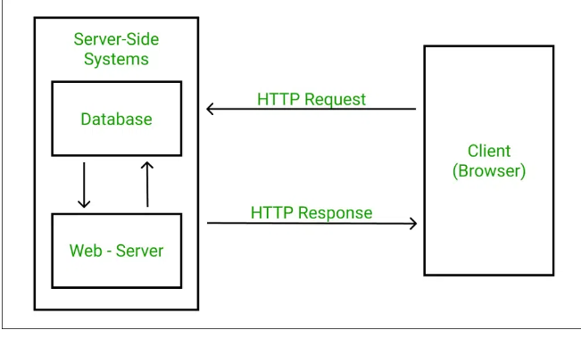
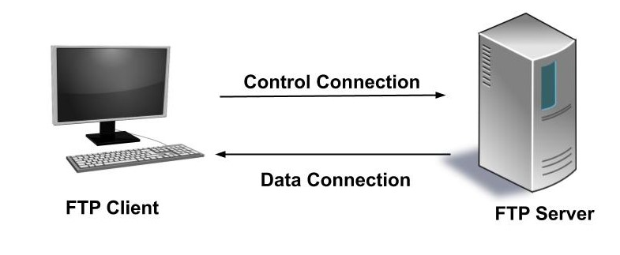
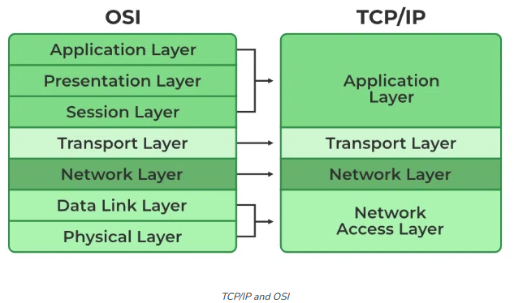

## Định nghĩa
Mô hình OSI vạch ra các giao thức chuẩn cho máy tính để thiết lập giao tiếp qua mạng.
## Ưu điểm khi sử dụng mô hình OSI
1. Troubleshooting :Mặc dù internet ngày nay không tuân thủ nghiêm ngặt mô hình OSI, nhưng mô hình OSI rất hữu ích để khắc phục sự cố mạng. Mô hình OSI là mô hình phân tầng được tạo thành từ các lớp độc lập, nghĩa là những thay đổi trong một tầng không ảnh hưởng đến các tầng khác. Nó giúp phân tích vấn đề và cô lập các vấn đề trong mạng do được chia thành nhiều lớp độc lập. 
2. Khả năng tương tác: bằng cách cung cấp các giao diện và giao thức chuẩn cho từng lớp, mô hình OSI đảm bảo rằng các thiết bị mạng từ các nhà cung cấp khác nhau có thể hoạt động liền mạch với nhau.
3. Khả năng mở rộng: mỗi lớp hoạt động dựa trên thông tin nhận được từ lớp bên trên, nhưng mỗi lớp xử lý thông tin đó theo cách độc lập với các lớp trước đó. Điều này cho phép thêm các lớp, công nghệ hoặc giao thức bổ sung nếu cần vào một lớp mà không ảnh hưởng đến chức năng của các lớp khác.

### OSI model:

 
 OSI được chia ra làm 7 lớp: 
 7. Application layer:
- trực tiếp tương tác với dữ liệu từ người dùng
- bao gồm các protocol và dữ liệu được dùng bởi phần mềm mà người dùng sử dụng như email hay trình duyệt web
6. Presentation layer:
- phụ trách xử lý dữ liệu bằng việc dịch, giải nén hoặc nén, và mã hóa dữ liệu
5. Session layer:
- phụ trách việc thiết lập, duy trì và hủy bỏ các session(phiên liên lạc) giữa các máy
4. Transport: 
- transport layer quản lý việc trao đổi dữ liệu giữa 2 thiết bị
- cung cấp phân đoạn dữ liệu thành các gói và cung cấp kiểm soát luồng và lỗi để đảm bảo truyền dữ liệu thích hợp
- thêm số cổng nguồn và đích vào các gói dữ liệu trước khi chuyển tiếp đến lớp network
- thực hiện việc tập hợp lại các gói dữ liệu (đối với TCP) theo số thứ tự của chúng.
3. Network: 
- chịu trách nhiệm quản lý việc trao đổi thông tin giữa các network khác nhau
- sử dụng router để kết nối các network:
	+ router kết nối với ISP(internet service provider)
	+ router có thể chọn lựa quãng đường thuận tiện nhất để gửi dữ liệu dưới dạng packets
	+ lưu thông tin về địa chỉ IP và routing information bằng routing table
2. Data link: chịu trách nhiệm trong việc điều khiển luồng và phát hiện lỗi (error-detection)
	- chia các gói dữ liệu thành các khung và thêm tiêu đề vào các khung (địa chỉ đích & nguồn, các bit kiểm soát lỗi (ví dụ: checksum),..)
- thêm địa chỉ vật lý (địa chỉ MAC) của người gửi và người nhận vào khung
- cung cấp cơ chế phát hiện và truyền lại các khung bị mất, đồng thời lắp ráp lại các khung ở đầu thu
1. Physical layer: bao gồm tất cả các hardware để vận hành network ví dụ như cable, router,...
### Cách truyền dữ liệu trong mô hình OSI
Dữ liệu di chuyển từ lớp 7 đến lớp 1 khi được gửi bởi người gửi và di chuyển từ lớp 1 sang lớp 7 khi người nhận nhận được.

1. Khi người gửi gửi tin nhắn đến người nhận, chẳng hạn như qua email, lớp 7 sẽ bao gồm các thông tin như kích thước màn hình và phông chữ và chuyển thông tin đó đến lớp 6
2. Lớp 6 xử lý mã hóa dữ liệu nếu cần và cũng thực hiện dịch dữ liệu như chuyển đổi dữ liệu sang ASCII
3. Lớp 5 sẽ tạo các phiên để cho phép liên lạc và kiểm soát luồng dữ liệu, đồng thời chuyển dữ liệu sang lớp 4.
4. Lớp 4 xử lý truyền dữ liệu và kiểm tra lỗi, chẳng hạn như sử dụng giao thức TCP để cho phép người nhận xác nhận nếu dữ liệu đã được gửi.
5. Lớp 3 thêm thông tin header như nguồn và đích của dữ liệu. Sau đó, nó xử lý việc phân phối dữ liệu qua mạng, bằng cách chia dữ liệu thành các gói và chọn đường dẫn thuận tiện nhất để gửi dữ liệu qua các bộ định tuyến
6. Lớp 2 thêm thông tin header và trailer sau khi chia các gói thành các khung. Lớp data link cũng đảm bảo rằng các khung không bị hỏng khi truyền đến người nhận.
7. Lớp 1 chuyển thông tin từ lớp 2 thành bit. Nó cũng đồng bộ hóa các bit để đảm bảo rằng dữ liệu mà máy thu nhận được sắp xếp chính xác.

Quá trình này xảy ra theo thứ tự ngược lại trên thiết bị đích.

### TCP/IP
Mô hình TCP/IP nêu chi tiết cách dữ liệu được truyền từ thiết bị này sang thiết bị khác qua mạng.
Nó được chia thành 4 lớp:
4. Lớp ứng dụng(Application layer):
- chịu trách nhiệm cung cấp cho người dùng quyền truy cập vào mạng
- người dùng tương tác trực tiếp với lớp này khi gửi và nhận dữ liệu, chẳng hạn như qua email và ứng dụng nhắn tin
3. Lớp vận chuyển( transport layer):
- Chịu trách nhiệm duy trì trao đổi dữ liệu
- cung cấp cơ chế xác nhận khi nhận được dữ liệu và yêu cầu truyền lại các gói bị thiếu, chẳng hạn như sử dụng giao thức TCP
2. Tầng Internet(Network layer):
- truyền các gói dữ liệu đến lớp tiếp theo
- chịu trách nhiệm cung cấp các gói dữ liệu chính xác đến đích của chúng
- sử dụng 3 giao thức chính:
	+ IP(Internet protocol): chịu trách nhiệm phân phát các gói dữ liệu từ nguồn đến đích bằng cách sử dụng địa chỉ IP được gán cho tiêu đề gói
	+ ICMP(Internet Control Message Protocol): là giao thức để các thiết bị mạng giao tiếp các vấn đề về truyền dữ liệu. Nó đóng gói các địa chỉ IP với các tiêu đề ICMP để truyền đạt các vấn đề về mạng, chẳng hạn như sử dụng tiêu đề ICMP để lưu trữ tiêu đề IP của gói gây ra lỗi. ICMP cũng có hai tính năng: theo dõi để hiển thị đường dẫn định tuyến và thời gian trên mỗi 'bước nhảy' của đường dẫn từ nguồn đến đích và ping để hiển thị thời gian một gói dữ liệu di chuyển đến đích và quay lại.
	+ ARP (Address Resolution Protocol): chịu trách nhiệm định vị MAC address từ địa chỉ IP
1. Lớp truy cập mạng(Network access layer)
- xử lý cơ sở hạ tầng vật lý để các máy tính giao tiếp với nhau, chẳng hạn như cáp và thẻ giao diện mạng (NIC)
- cũng đóng gói dữ liệu vào các khung(frame) để truyền và kiểm tra lỗi (tương tự như lớp 2 của mô hình OSI)

### Các giao thức TCP/IP thông dụng
1. HTTP (Giao thức truyền siêu văn bản)
- cung cấp một tiêu chuẩn cho trình duyệt web và máy chủ web để giao tiếp
+ trình duyệt web gửi URL đến Domain name server (DNS)
+ DNS kiểm tra các bản ghi của URL và trả về địa chỉ IP tương ứng với URL này
+ trình duyệt hiện giao tiếp với máy chủ thực bằng địa chỉ IP này

2. FTP (File transfer protocol)
- một giao thức cho phép phần mềm và dữ liệu được truyền giữa các loại máy tính khác nhau sử dụng TCP/IP
- sử dụng mô hình máy khách-máy chủ, trong đó máy khách sử dụng kênh điều khiển để gửi yêu cầu đến máy chủ và máy chủ sử dụng kết nối dữ liệu để gửi dữ liệu theo yêu cầu của máy khách

### TCP/IP vs OSI model

References:
1. [Source 1](https://www.ccexpert.us/distance-vector/how-data-flows-through-the-osi-layers.html)
2. [Source 2](https://www.cloudflare.com/learning/ddos/glossary/internet-control-message-protocol-icmp/)
3. [Source 3](https://www.guru99.com/tcp-ip-model.html)
4. [Source 4](https://afteracademy.com/blog/what-is-ftp-and-how-does-an-ftp-work/)
5. [Source 5](https://www.geeksforgeeks.org/http-full-form/)

